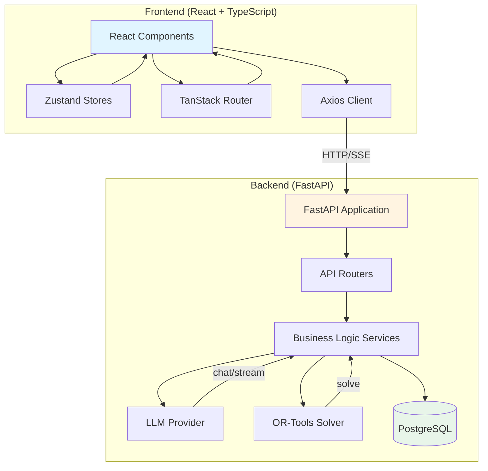
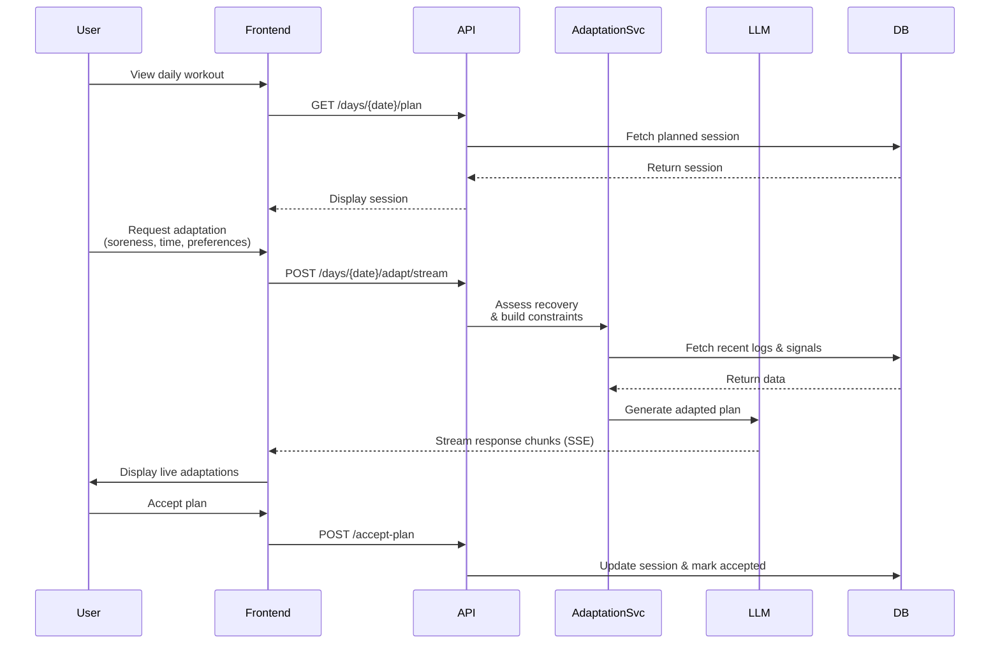

# Gainsly System Architecture

## Overview

Gainsly is an AI-enabled workout coach that creates adaptive 8-12 week strength/fitness programs and adapts daily sessions based on user preferences, constraints, and recovery signals. The system follows a hybrid LLM and constraint-based optimization approach for workout generation.

## Technology Stack

| Component | Technology |
|-----------|-----------|
| Backend API | FastAPI (Python 3.11+) |
| Database | PostgreSQL (SQLAlchemy async engine) |
| LLM Provider | Ollama (local, llama3.2:3b) |
| Constraint Solver | Google OR-Tools (CP-SAT) |
| Frontend | React 19 + TypeScript + Vite |
| Router | TanStack Router |
| State Management | Zustand |
| Styling | Tailwind CSS |
| HTTP Client | Axios |
| Real-time Updates | Server-Sent Events (SSE) |
| Database Migrations | Alembic |

## System Architecture Diagram



## Component Layers

### Presentation Layer (Frontend)

The frontend is a single-page application built with React 19 and TypeScript, using TanStack Router for file-based routing and Zustand for state management.

**Key Components:**
- [AppShell](file:///Users/shourjosmac/Documents/Gainsly/frontend/src/components/layout/app-shell.tsx) - Main layout wrapper with Header, BottomNav, and BurgerMenu
- [WizardContainer](file:///Users/shourjosmac/Documents/Gainsly/frontend/src/components/wizard/WizardContainer.tsx) - Multi-step program creation wizard
- [SessionCard](file:///Users/shourjosmac/Documents/Gainsly/frontend/src/components/program/SessionCard.tsx) - Display individual workout sessions
- [SorenessTracker](file:///Users/shourjosmac/Documents/Gainsly/frontend/src/components/visuals/SorenessTracker.tsx) - Interactive body soreness logging

**State Stores:**
- [program-wizard-store](file:///Users/shourjosmac/Documents/Gainsly/frontend/src/stores/program-wizard-store.ts) - Manages program creation wizard state
- [ui-store](file:///Users/shourjosmac/Documents/Gainsly/frontend/src/stores/ui-store.ts) - Global UI state management

### API Layer (Backend)

FastAPI provides RESTful endpoints with SSE streaming support for real-time LLM responses.

**Routers:**
- [programs.py](file:///Users/shourjosmac/Documents/Gainsly/app/api/routes/programs.py) - Program CRUD operations and microcycle management
- [days.py](file:///Users/shourjosmac/Documents/Gainsly/app/api/routes/days.py) - Daily planning with SSE streaming for adaptation
- [logs.py](file:///Users/shourjosmac/Documents/Gainsly/app/api/routes/logs.py) - Workout logging and e1RM calculations
- [settings.py](file:///Users/shourjosmac/Documents/Gainsly/app/api/routes/settings.py) - User preferences and profile management
- [circuits.py](file:///Users/shourjosmac/Documents/Gainsly/app/api/routes/circuits.py) - Circuit library management
- [activities.py](file:///Users/shourjosmac/Documents/Gainsly/app/api/routes/activities.py) - Activity definitions and tracking

### Service Layer

Business logic is encapsulated in service modules that coordinate between the API layer, LLM provider, constraint solver, and database.

**Core Services:**
- [session_generator.py](file:///Users/shourjosmac/Documents/Gainsly/app/services/session_generator.py) - Generates workout session content using LLM with retry logic
- [optimization.py](file:///Users/shourjosmac/Documents/Gainsly/app/services/optimization.py) - OR-Tools constraint solver for optimal movement selection
- [adaptation.py](file:///Users/shourjosmac/Documents/Gainsly/app/services/adaptation.py) - Daily session adaptation based on recovery and constraints
- [deload.py](file:///Users/shourjosmac/Documents/Gainsly/app/services/deload.py) - Intelligent deload scheduling logic
- [interference.py](file:///Users/shourjosmac/Documents/Gainsly/app/services/interference.py) - Recreational activity interference management
- [metrics.py](file:///Users/shourjosmac/Documents/Gainsly/app/services/metrics.py) - Pattern Strength Index (PSI) and performance metrics
- [time_estimation.py](file:///Users/shourjosmac/Documents/Gainsly/app/services/time_estimation.py) - Workout duration estimation by section

### Data Layer

PostgreSQL database with SQLAlchemy async ORM, managed via Alembic migrations.

**Key Models:**
- [user.py](file:///Users/shourjosmac/Documents/Gainsly/app/models/user.py) - User profiles and preferences
- [program.py](file:///Users/shourjosmac/Documents/Gainsly/app/models/program.py) - Programs, microcycles, and sessions
- [movement.py](file:///Users/shourjosmac/Documents/Gainsly/app/models/movement.py) - Movement library and rules
- [logging.py](file:///Users/shourjosmac/Documents/Gainsly/app/models/logging.py) - Workout logs, e1RM calculations
- [circuit.py](file:///Users/shourjosmac/Documents/Gainsly/app/models/circuit.py) - Circuit templates and metrics
- [enums.py](file:///Users/shourjosmac/Documents/Gainsly/app/models/enums.py) - Type definitions for categorical data

## The Adaptive Loop

The adaptive loop is the core mechanism that enables Gainsly to dynamically adjust workouts based on user feedback, recovery signals, and constraints.



### Adaptive Loop Components

1. **Signal Collection**
   - Soreness logging via [SorenessTracker](file:///Users/shourjosmac/Documents/Gainsly/frontend/src/components/visuals/SorenessTracker.tsx)
   - Recovery signals (sleep, readiness, HRV) from integrations
   - Manual check-in responses (time available, preferences)
   - External activity tracking (Strava, Garmin, Apple Health)

2. **Recovery Assessment**
   - [adaptation.py:_assess_recovery](file:///Users/shourjosmac/Documents/Gainsly/app/services/adaptation.py) - Calculates recovery score (0-100)
   - Combines recent soreness logs, recovery signals, and workout history
   - Identifies fatigue patterns and recovery needs

3. **Constraint Building**
   - User movement rules (exercises to avoid or prioritize)
   - Time availability constraints
   - Equipment limitations
   - Injury or soreness-based exclusions

4. **Adaptive Decision**
   - **LLM Role**: Provides creative exercise suggestions, explains reasoning, generates alternative options
   - **OR-Tools Role**: Ensures volume targets are met, optimizes stimulus-to-fatigue ratio, validates constraints
   - Combined approach: LLM proposes, OR-Tools validates and optimizes

5. **Plan Execution**
   - User accepts adapted plan via frontend
   - Session is updated in database
   - Performance metrics are logged after workout completion

## LLM vs. OR-Tools: Role Differentiation

### LLM (Ollama with llama3.2:3b)

**Primary Responsibilities:**
- Creative exercise selection from movement library
- Workout phrasing and coaching communication
- Explanation of adaptation rationale
- Generation of alternative options
- Conversation handling for iterative refinement

**Strengths:**
- Natural language understanding and generation
- Contextual reasoning about user preferences
- Ability to provide explanations and trade-offs
- Flexible response to open-ended constraints

**Limitations:**
- No guarantee of constraint satisfaction
- Potential for inconsistent volume distribution
- Limited mathematical optimization capabilities
- May hallucinate movement combinations

### OR-Tools Constraint Solver (CP-SAT)

**Primary Responsibilities:**
- Enforce hard constraints (time, volume, equipment)
- Optimize stimulus-to-fatigue ratio
- Ensure balanced muscle group coverage
- Validate movement selections against targets
- Handle exclusion and inclusion rules

**Strengths:**
- Guaranteed constraint satisfaction
- Mathematical optimization
- Consistent and deterministic results
- Scalable to complex constraint sets

**Limitations:**
- No natural language understanding
- Cannot provide explanations or alternatives
- Requires all constraints to be explicitly defined
- Limited to defined objective functions

### Hybrid Approach

The system uses a hybrid approach that leverages the strengths of both:

1. **Initial Proposal**: LLM generates a workout based on goals, split template, and user preferences
2. **Constraint Validation**: OR-Tools validates the proposal against all hard constraints
3. **Optimization**: OR-Tools optimizes the movement selection to maximize stimulus while minimizing fatigue
4. **Final Polish**: LLM adds coaching language, explains the adaptations, and provides alternatives

This approach ensures workouts are both creatively tailored to the user and mathematically optimized for their goals.

## Data Flow Diagram

```mermaid
flowchart TD
    Start[User creates program] --> Wizard[Program Wizard]
    Wizard --> Goals[Define goals & weights]
    Goals --> Split[Select split template]
    Split --> Disciplines[Set discipline priorities]
    Disciplines --> Movements[Configure movement rules]
    Movements --> Activities[Add enjoyable activities]
    Activities --> Persona[Set coach persona]
    
    Persona --> API[POST /programs]
    API --> Service[program_service.create_program]
    Service --> DB1[(Create program)]
    Service --> Generator[Generate microcycles]
    Generator --> DB2[(Create microcycles)]
    Generator --> BGT[Background task]
    BGT --> SessionGen[session_generator.generate_sessions]
    
    SessionGen --> LLM[LLM: Generate session content]
    LLM --> Solver[OR-Tools: Validate & optimize]
    Solver --> DB3[(Populate sessions)]
    
    UserView[User views daily plan] --> API2[GET /days/{date}/plan]
    API2 --> DB4[(Fetch session)]
    DB4 --> UserView
    
    Adapt[User requests adaptation] --> API3[POST /days/{date}/adapt/stream]
    API3 --> AdaptSvc[adaptation_service]
    AdaptSvc --> Recovery[Assess recovery]
    Recovery --> LLM2[LLM: Generate adapted plan]
    LLM2 --> SSE[Stream response via SSE]
    SSE --> UserView
    
    UserAccept[User accepts plan] --> API4[POST /accept-plan]
    API4 --> DB5[(Update session)]
```

## Glossary

| Term | Definition |
|------|------------|
| **Microcycle** | A training cycle (typically 7-14 days) containing planned workout sessions |
| **Split Template** | A predefined structure for distributing training across the week (e.g., PPL, Upper/Lower, Full Body) |
| **Progression Style** | The method for increasing training difficulty over time (e.g., single progression, double progression) |
| **e1RM** | Estimated one-rep maximum calculated from submaximal sets |
| **PSI** | Pattern Strength Index - tracks strength across movement patterns (squat, hinge, push, pull, etc.) |
| **Deload** | A planned reduction in training volume/intensity to promote recovery |
| **SSE** | Server-Sent Events - real-time streaming protocol for LLM responses |
| **CSP** | Constraint Satisfaction Problem - mathematical problem type solved by OR-Tools |
| **CP-SAT** | Constraint Programming-SAT - OR-Tools solver for constraint satisfaction |
| **Interference** | Impact of recreational activities on training adaptations |

## Related Documents

- [DATABASE_OVERVIEW.md](file:///Users/shourjosmac/Documents/Gainsly/DATABASE_OVERVIEW.md) - Complete database schema documentation
- [02_Backend_API_and_Logic.md](file:///Users/shourjosmac/Documents/Gainsly/NotebookLM_docs/02_Backend_API_and_Logic.md) - Backend API endpoints and algorithms
- [03_Frontend_Architecture.md](file:///Users/shourjosmac/Documents/Gainsly/NotebookLM_docs/03_Frontend_Architecture.md) - Frontend component hierarchy and routing
- [04_Component_Interaction_Map.md](file:///Users/shourjosmac/Documents/Gainsly/NotebookLM_docs/04_Component_Interaction_Map.md) - Component dependencies and event flows
