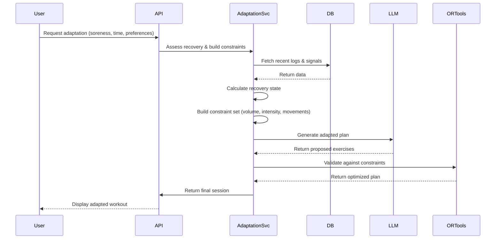

# Backend API and Logic

## Overview
Gainsly's backend is a FastAPI-based REST API with SQLAlchemy async ORM, PostgreSQL database, and integration with Ollama LLM and Google OR-Tools for intelligent workout planning and adaptation.

## Table of Contents
1. [Technology Stack](#technology-stack)
2. [Endpoint Map](#endpoint-map)
3. [Authentication & Authorization](#authentication--authorization)
4. [Core Algorithms](#core-algorithms)
5. [Background Tasks](#background-tasks)
6. [Error Handling](#error-handling)
7. [Cross-References](#cross-references)

---

## Technology Stack

| Component | Technology | Purpose |
|-----------|------------|---------|
| Web Framework | FastAPI 0.104+ | Async REST API with automatic validation |
| ORM | SQLAlchemy 2.0+ async | Async database operations with Pydantic models |
| Database | PostgreSQL 14+ | Persistent data storage |
| LLM | Ollama (llama3.2:3b) | Creative workout suggestions and reasoning |
| Optimization | Google OR-Tools CP-SAT | Constraint validation and optimization |
| API Testing | pytest-asyncio | Async test suite |

---

## Endpoint Map

### Programs Module (`/api/programs`)

| Method | Endpoint | Description | Request Body | Response |
|--------|----------|-------------|--------------|----------|
| POST | `/api/programs` | Create new program | ProgramCreate | ProgramResponse |
| GET | `/api/programs` | List all user programs | - | List[ProgramResponse] |
| GET | `/api/programs/{program_id}` | Get program details | - | ProgramResponse |
| PUT | `/api/programs/{program_id}` | Update program | ProgramUpdate | ProgramResponse |
| DELETE | `/api/programs/{program_id}` | Delete program | - | SuccessResponse |
| GET | `/api/programs/{program_id}/microcycle` | Get microcycle structure | - | MicrocycleResponse |
| PUT | `/api/programs/{program_id}/microcycle` | Update microcycle | MicrocycleUpdate | MicrocycleResponse |

**Key Functions:**
- `create_program`: Validates program configuration, creates base program with default microcycle
- `get_program_microcycle`: Retrieves microcycle day assignments and split template
- `update_program_microcycle`: Updates microcycle length and day splits (supports 7-14 day cycles)

**Frontend Integration:**
- Frontend: `frontend/src/routes/program.$programId.tsx`
- State: `frontend/src/stores/program-wizard-store.ts`

---

### Days Module (`/api/days`)

| Method | Endpoint | Description | Request Body | Response |
|--------|----------|-------------|--------------|----------|
| GET | `/api/days/{date}/plan` | Get planned session for date | - | SessionResponse |
| POST | `/api/days/{date}/adapt` | Request adaptation (blocking) | AdaptationRequest | SessionResponse |
| POST | `/api/days/{date}/adapt/stream` | Stream adaptation (SSE) | AdaptationRequest | Server-Sent Events |

**Key Functions:**
- `get_day_plan`: Retrieves pre-planned session or generates new session if none exists
- `adapt_session_stream`: Initiates SSE stream for real-time LLM adaptation responses

**SSE Streaming Implementation:**
```python
async def adapt_session_stream(
    date: date,
    adaptation_request: AdaptationRequest,
    db: AsyncSession = Depends(get_db),
    user_id: int = Depends(get_current_user_id),
):
    async def event_generator():
        async for chunk in adaptation_service.stream_adaptation(
            date, adaptation_request, user_id, db
        ):
            yield f"data: {chunk}\n\n"
        yield "data: [DONE]\n\n"
    
    return StreamingResponse(
        event_generator(),
        media_type="text/event-stream",
        headers={
            "Cache-Control": "no-cache",
            "Connection": "keep-alive",
            "X-Accel-Buffering": "no"
        }
    )
```

**Frontend Integration:**
- Frontend: `frontend/src/api/client.ts` (streamSSE utility)
- UI Components: Daily workout view, adaptation modal

---

### Logs Module (`/api/logs`)

| Method | Endpoint | Description | Request Body | Response |
|--------|----------|-------------|--------------|----------|
| POST | `/api/logs/custom` | Log custom workout | CustomWorkoutCreate | WorkoutLogResponse |
| POST | `/api/logs/top-set` | Log top set | TopSetLogCreate | WorkoutLogResponse |
| GET | `/api/logs/soreness` | Get soreness history | QueryParams | List[SorenessLog] |
| POST | `/api/logs/soreness` | Log soreness | SorenessLogCreate | SorenessLogResponse |
| GET | `/api/logs/recovery-state` | Get muscle recovery state | - | RecoveryStateResponse |

**Key Functions:**
- `create_custom_workout_log`: Logs custom workouts with exercise-specific metrics
- `log_top_set`: Logs top set attempts for progressive overload tracking
- `get_muscle_recovery_state`: Calculates recovery percentages per muscle group with decay logic

**e1RM Calculation Algorithm:**
```python
def calculate_e1rm(weight: float, reps: int) -> float:
    if reps == 1:
        return weight
    return weight * (36 / (37 - reps))
```

**Recovery Decay Logic:**
```python
def calculate_recovery_with_decay(
    last_soreness: int,
    days_since: int,
    recovery_rate: float = 0.1
) -> float:
    decay_factor = (1 - recovery_rate) ** days_since
    return max(0, last_soreness * decay_factor)
```

**Frontend Integration:**
- Frontend: Workout logging components, recovery visualization
- State: Workout history stores, recovery state management

---

### Settings Module (`/api/settings`)

| Method | Endpoint | Description | Request Body | Response |
|--------|----------|-------------|--------------|----------|
| GET | `/api/settings/profile` | Get user profile | - | UserProfileResponse |
| PUT | `/api/settings/profile` | Update profile | UserProfileUpdate | UserProfileResponse |
| GET | `/api/settings/movement-rules` | Get movement rules | - | List[MovementRule] |
| POST | `/api/settings/movement-rules` | Create movement rule | MovementRuleCreate | MovementRule |
| DELETE | `/api/settings/movement-rules/{rule_id}` | Delete movement rule | - | SuccessResponse |
| GET | `/api/settings/enjoyable-activities` | Get enjoyable activities | - | List[Activity] |
| POST | `/api/settings/enjoyable-activities` | Add activity | ActivityCreate | Activity |

**Key Functions:**
- `get_user_profile`: Retrieves user settings including name, age, training experience, goals
- `get_movement_rules`: Retrieves user-specific movement restrictions and preferences
- `update_user_profile`: Updates user settings with validation

**Frontend Integration:**
- Frontend: `frontend/src/routes/settings.tsx` (Profile tab)
- State: User settings store

---

## Authentication & Authorization

### Dependency Injection Pattern
All protected routes use FastAPI dependency injection for authentication and database access:

```python
async def get_current_user_id(
    request: Request,
    db: AsyncSession = Depends(get_db)
) -> int:
    auth_header = request.headers.get("Authorization")
    if not auth_header or not auth_header.startswith("Bearer "):
        raise HTTPException(status_code=401, detail="Missing or invalid token")
    
    token = auth_header.split(" ")[1]
    payload = jwt.decode(token, SECRET_KEY, algorithms=[ALGORITHM])
    user_id = payload.get("sub")
    
    if not user_id:
        raise HTTPException(status_code=401, detail="Invalid token")
    
    return int(user_id)
```

### Route Protection Example
```python
@router.get("/programs/{program_id}")
async def get_program(
    program_id: int,
    db: AsyncSession = Depends(get_db),
    user_id: int = Depends(get_current_user_id)
) -> ProgramResponse:
    program = await program_service.get_program(program_id, user_id, db)
    if not program:
        raise HTTPException(status_code=404, detail="Program not found")
    return program
```

**Flow:**
1. Frontend sends JWT token in `Authorization: Bearer <token>` header
2. FastAPI middleware intercepts request and validates token
3. `get_current_user_id` extracts `user_id` from token payload
4. Route handler receives authenticated `user_id` for authorization

**Frontend Integration:**
- Frontend: `frontend/src/api/client.ts` (Axios interceptor adds token)
- Token Storage: Browser localStorage (access token + refresh token)

---

## Core Algorithms

### Adaptive Workout Planning Loop

The adaptive loop is the core mechanism for dynamic workout adjustment:



**Algorithm Steps:**

1. **Signal Collection**: Gather user inputs (soreness, time availability, equipment, preferences)
2. **Recovery Assessment**: Calculate per-muscle recovery state using decay logic
3. **Constraint Building**: Build constraint set for OR-Tools solver
   - Volume constraints (sets, reps based on recovery)
   - Intensity constraints (RPE ranges based on fatigue)
   - Movement constraints (injury restrictions, equipment availability)
   - Time constraints (total workout duration)
4. **Adaptive Decision**: Use LLM to generate creative workout proposals
5. **Plan Validation**: Use OR-Tools to validate and optimize proposals
6. **Plan Execution**: Return final session to frontend

**Key Services:**
- `app/services/adaptation_service.py`: Orchestrates adaptive loop
- `app/services/session_generator.py`: LLM integration with retry logic
- `app/services/optimization.py`: OR-Tools constraint solving

---

### LLM Integration (Ollama)

**Session Generation with Retry Logic:**

```python
async def generate_session_exercises(
    constraints: Dict[str, Any],
    user_profile: UserProfile,
    model: str = "llama3.2:3b"
) -> List[Exercise]:
    prompt = build_session_prompt(constraints, user_profile)
    
    max_retries = 3
    for attempt in range(max_retries):
        try:
            response = await ollama_client.generate(
                model=model,
                prompt=prompt,
                stream=False,
                options={"temperature": 0.7}
            )
            
            exercises = parse_llm_response(response["response"])
            
            if validate_exercises(exercises, constraints):
                return exercises
            
            if attempt < max_retries - 1:
                prompt = refine_prompt(prompt, exercises, constraints)
                
        except Exception as e:
            logger.error(f"LLM generation failed (attempt {attempt + 1}): {e}")
            if attempt == max_retries - 1:
                raise
    
    raise GenerationFailedError("Failed to generate valid session after retries")
```

**Prompt Engineering Strategy:**
- System prompt defines LLM role (workout planning expert)
- User prompt includes constraints, recovery state, equipment, preferences
- Few-shot examples for output format
- Validation rules for generated exercises

---

### OR-Tools Constraint Solving

**CP-SAT Solver for Workout Optimization:**

```python
def solve_session(
    proposed_exercises: List[Exercise],
    constraints: Dict[str, Any]
) -> OptimizedSession:
    model = cp_model.CpModel()
    
    exercise_vars = {}
    for i, exercise in enumerate(proposed_exercises):
        exercise_vars[i] = model.NewBoolVar(f"exercise_{i}")
    
    volume_var = model.NewIntVar(
        constraints["min_sets"],
        constraints["max_sets"],
        "total_sets"
    )
    
    model.Add(
        volume_var == sum(
            exercise_vars[i] * exercise.sets
            for i, exercise in enumerate(proposed_exercises)
        )
    )
    
    for muscle_group, max_load in constraints["muscle_loads"].items():
        muscle_var = sum(
            exercise_vars[i] * calculate_muscle_load(exercise, muscle_group)
            for i, exercise in enumerate(proposed_exercises)
        )
        model.Add(muscle_var <= max_load)
    
    model.Maximize(
        sum(
            exercise_vars[i] * calculate_stimulus_score(exercise, constraints)
            for i, exercise in enumerate(proposed_exercises)
        )
    )
    
    solver = cp_model.CpSolver()
    status = solver.Solve(model)
    
    if status != cp_model.OPTIMAL and status != cp_model.FEASIBLE:
        raise OptimizationFailedError("No feasible solution found")
    
    return build_optimized_session(solver, exercise_vars, proposed_exercises)
```

**Optimization Objectives:**
- Maximize stimulus-to-fatigue ratio
- Satisfy all user constraints
- Minimize equipment changes
- Balance muscle group engagement

---

## Background Tasks

### Session Pre-Generation
- **Purpose**: Generate next day's session in advance for faster load times
- **Schedule**: Runs nightly at 2 AM UTC
- **Implementation**: Celery Beat scheduler with SQLAlchemy async sessions

### Data Cleanup
- **Purpose**: Archive old logs, cleanup temporary data
- **Schedule**: Runs weekly on Sundays
- **Retention**: 90 days for detailed logs, 1 year for summary data

### Model Refresh
- **Purpose**: Refresh LLM model cache, update exercise database
- **Schedule**: Runs daily at 3 AM UTC
- **Implementation**: Background task with database connection pooling

---

## Error Handling

### Global Exception Handler

```python
@app.exception_handler(HTTPException)
async def http_exception_handler(request: Request, exc: HTTPException):
    return JSONResponse(
        status_code=exc.status_code,
        content={"detail": exc.detail}
    )

@app.exception_handler(GenerationFailedError)
async def generation_failed_handler(request: Request, exc: GenerationFailedError):
    logger.error(f"Session generation failed: {exc}")
    return JSONResponse(
        status_code=503,
        content={
            "detail": "Unable to generate workout plan. Please try again later.",
            "error_code": "GENERATION_FAILED"
        }
    )

@app.exception_handler(OptimizationFailedError)
async def optimization_failed_handler(request: Request, exc: OptimizationFailedError):
    logger.warning(f"Optimization failed, using fallback: {exc}")
    return JSONResponse(
        status_code=200,
        content={
            "detail": "Using simplified workout plan",
            "fallback": True
        }
    )
```

### Database Error Handling
```python
async def with_db_error_handling(operation: Callable):
    try:
        return await operation()
    except AsyncSessionError as e:
        logger.error(f"Database session error: {e}")
        raise HTTPException(status_code=500, detail="Database error")
    except IntegrityError as e:
        logger.error(f"Database integrity error: {e}")
        raise HTTPException(status_code=409, detail="Conflict with existing data")
```

---

## Cross-References

### Database Schema
- See [DATABASE_OVERVIEW.md](../DATABASE_OVERVIEW.md) for complete schema documentation
- Key tables: `programs`, `sessions`, `exercises`, `workout_logs`, `user_settings`

### Frontend Components
- **Program Management**: `frontend/src/routes/program.$programId.tsx`
- **Daily Workouts**: `frontend/src/routes/day.$date.tsx` (SSE streaming)
- **Settings**: `frontend/src/routes/settings.tsx` (Profile tab)
- **API Client**: `frontend/src/api/client.ts` (streamSSE utility)

### Architecture
- See [01_System_Architecture.md](./01_System_Architecture.md) for system-level design
- See [03_Frontend_Architecture.md](./03_Frontend_Architecture.md) for component hierarchy
- See [04_Component_Interaction_Map.md](./04_Component_Interaction_Map.md) for dependency matrix

### Implementation Plans
- See `docs/plans/optimization-engine.md` for OR-Tools solver details
- See `docs/plans/adaptive-workout-loop.md` for adaptive loop implementation
- See `docs/plans/llm-integration.md` for LLM provider configuration

---

## Glossary

- **e1RM**: Estimated one-repetition maximum
- **SSE**: Server-Sent Events (real-time streaming)
- **CP-SAT**: Constraint Programming-SATisfiability (OR-Tools solver)
- **RPE**: Rate of Perceived Exertion (1-10 scale)
- **Microcycle**: Training cycle length (typically 7-14 days)
- **Stimulus-to-Fatigue Ratio**: Training efficiency metric
- **Decay Logic**: Algorithm for calculating recovery over time
- **Adaptive Loop**: Core mechanism for dynamic workout adjustment

---

## Tags

#backend #api #fastapi #sqlalchemy #llm #or-tools #optimization #authentication #sse #endpoints #algorithms #database #postgresql #async #python
