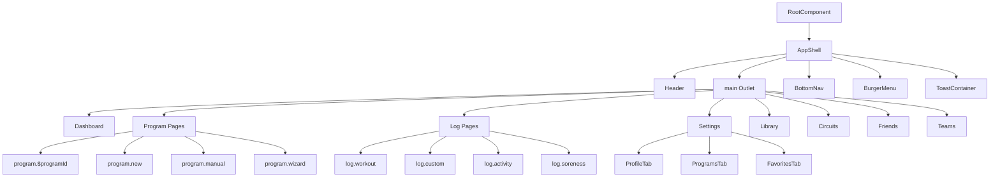

# Frontend Architecture

## Overview
Gainsly's frontend is a React 19 + TypeScript SPA built with TanStack Router for routing, Zustand for client state, TanStack Query for server state, and Tailwind CSS for styling. The app follows a component-based architecture with clear separation of concerns.

## Table of Contents
1. [Technology Stack](#technology-stack)
2. [Component Hierarchy](#component-hierarchy)
3. [Routing Structure](#routing-structure)
4. [State Management](#state-management)
5. [Styling Patterns](#styling-patterns)
6. [API Integration](#api-integration)
7. [Cross-References](#cross-references)

---

## Technology Stack

| Component | Technology | Purpose |
|-----------|------------|---------|
| Framework | React 19 | UI library with concurrent features |
| Language | TypeScript 5+ | Type safety and developer experience |
| Routing | TanStack Router | File-based routing with type safety |
| Server State | TanStack Query (React Query) | Data fetching, caching, synchronization |
| Client State | Zustand | Lightweight state management |
| Styling | Tailwind CSS | Utility-first CSS framework |
| HTTP Client | Axios | API communication with interceptors |
| Icons | Lucide React | Icon library |
| Build Tool | Vite | Fast development server and bundler |

---

## Component Hierarchy

### Root Layout Structure



### Component Organization

#### Layout Components (`components/layout/`)
- **AppShell**: Root layout wrapper with header, main content, bottom nav
- **Header**: Top navigation bar with menu toggle
- **BottomNav**: Bottom tab navigation (Personal, Teams)
- **BurgerMenu**: Slide-out menu for additional navigation
- **Dashboard**: Main dashboard with program overview, quick actions

#### Program Components (`components/program/`)
- **SessionCard**: Display workout session with exercise details
- Reusable across dashboard and program detail pages

#### Settings Components (`components/settings/`)
- **ProfileTab**: User profile settings (name, age, goals)
- **ProgramsTab**: Program management (create, edit, delete)
- **FavoritesTab**: Saved movements and exercises

#### Visual Components (`components/visuals/`)
- **HumanBodyMap**: Interactive body diagram for muscle selection
- **MuscleList**: List of muscle groups with recovery indicators
- **SorenessTracker**: Soreness input interface with visual feedback

#### Wizard Components (`components/wizard/`)
- **WizardContainer**: Multi-step form wrapper
- **GoalsStep**: Goal selection (strength, hypertrophy, endurance)
- **SplitStep**: Days per week, duration, split template selection
- **DisciplinesStep**: Discipline weighting (bodybuilding, powerlifting, etc.)
- **ProgressionStep**: Progression style selection (linear, undulating, etc.)
- **MovementsStep**: Movement rules and restrictions
- **ActivitiesStep**: Enjoyable activities selection
- **CoachStep**: Communication style and push intensity

#### UI Components (`components/ui/`)
- **Button**: Reusable button with variants (primary, secondary, ghost)
- **Card**: Content container with shadow and border
- **Tabs**: Tabbed interface component
- **Toast**: Notification display component

#### Common Components (`components/common/`)
- **Spinner**: Loading indicator

---

## Routing Structure

### File-Based Routing with TanStack Router

```
frontend/src/routes/
├── __root.tsx              # Root layout (AppShell wrapper)
├── index.tsx               # Dashboard (/)
├── settings.tsx            # Settings page (/settings)
├── programs.tsx            # Programs list (redirects to settings)
├── favorites.tsx           # Favorites (redirects to settings)
├── program.$programId.tsx  # Program detail (/program/:programId)
├── program.new.tsx         # Create program manually (/program/new)
├── program.manual.tsx      # Manual program entry
├── program.wizard.tsx      # Program creation wizard
├── log.workout.tsx         # Log workout (/log/workout)
├── log.custom.tsx          # Log custom workout
├── log.activity.tsx        # Log activity
├── log.soreness.tsx        # Log soreness
├── circuits.tsx            # Circuit library
├── library.tsx             # Exercise library
├── movements.tsx           # Movement catalog
├── friends.tsx             # Friends list
├── teams.tsx               # Teams overview
└── admin.circuits.$circuitId.tsx  # Circuit admin
```

### Root Route Configuration

```typescript
// frontend/src/routes/__root.tsx
import { createRootRoute, Outlet } from '@tanstack/react-router';
import { TanStackRouterDevtools } from '@tanstack/router-devtools';
import { AppShell } from '@/components/layout/app-shell';

export const Route = createRootRoute({
  component: RootComponent,
});

function RootComponent() {
  return (
    <>
      <AppShell>
        <Outlet />
      </AppShell>
      {import.meta.env.DEV && <TanStackRouterDevtools position="bottom-right" />}
    </>
  );
}
```

### Dashboard Route

```typescript
// frontend/src/routes/index.tsx
import { createFileRoute } from '@tanstack/react-router';
import { Dashboard } from '@/components/layout/dashboard';

export const Route = createFileRoute('/')({
  component: Dashboard,
});
```

### Navigation Patterns

**Program Detail Route:**
```typescript
// Navigate to program detail
router.navigate({ to: '/program/$programId', params: { programId: '123' } });

// Link component usage
<Link to="/program/$programId" params={{ programId: program.id }}>
  {program.name}
</Link>
```

**Bottom Nav Active State:**
```typescript
const location = useLocation();
const isActive = location.pathname === item.to ||
  (item.to !== '/' && location.pathname.startsWith(item.to));
```

---

## State Management

### Client State (Zustand)

#### UI Store (`stores/ui-store.ts`)

```typescript
interface UIState {
  // Menu state
  isMenuOpen: boolean;
  setMenuOpen: (open: boolean) => void;
  toggleMenu: () => void;
  
  // Active program (for dashboard context)
  activeProgramId: number | null;
  setActiveProgramId: (id: number | null) => void;
  
  // Active workout session
  activeWorkoutSessionId: number | null;
  setActiveWorkoutSessionId: (id: number | null) => void;
  
  // Program wizard step (for multi-step form)
  programWizardStep: number;
  setProgramWizardStep: (step: number) => void;
  nextWizardStep: () => void;
  prevWizardStep: () => void;
  resetWizardStep: () => void;
  
  // Toast notifications
  toasts: Toast[];
  addToast: (toast: Omit<Toast, 'id'>) => void;
  removeToast: (id: string) => void;
  
  // Theme (for future light mode support)
  theme: 'dark' | 'light';
  setTheme: (theme: 'dark' | 'light') => void;
}

export const useUIStore = create<UIState>()(
  persist(
    (set) => ({ /* ... */ }),
    {
      name: 'gainsly-ui-storage',
      partialize: (state) => ({
        activeProgramId: state.activeProgramId,
        theme: state.theme,
      }),
    }
  )
);
```

**Usage Example:**
```typescript
const { isMenuOpen, toggleMenu, activeProgramId, setActiveProgramId } = useUIStore();

// Toggle menu
toggleMenu();

// Set active program
setActiveProgramId(programId);
```

#### Program Wizard Store (`stores/program-wizard-store.ts`)

```typescript
interface ProgramWizardState {
  // Step 1: Goals
  goals: GoalWeight[];
  setGoals: (goals: GoalWeight[]) => void;
  updateGoalWeight: (goal: Goal, weight: number) => void;
  
  // Step 2: Split
  daysPerWeek: number;
  setDaysPerWeek: (days: number) => void;
  maxDuration: number;
  setMaxDuration: (minutes: number) => void;
  splitPreference: SplitTemplate | null;
  setSplitPreference: (split: SplitTemplate | null) => void;
  
  // Step 3: Disciplines
  disciplines: DisciplineWeight[];
  setDisciplines: (disciplines: DisciplineWeight[]) => void;
  
  // Step 4: Progression
  progressionStyle: ProgressionStyle | null;
  setProgressionStyle: (style: ProgressionStyle | null) => void;
  
  // Step 5: Movements
  movementRules: MovementRuleCreate[];
  setMovementRules: (rules: MovementRuleCreate[]) => void;
  
  // Step 6: Activities
  enjoyableActivities: EnjoyableActivityCreate[];
  setEnjoyableActivities: (activities: EnjoyableActivityCreate[]) => void;
  
  // Step 7: Coach persona
  communicationStyle: string;
  pushIntensity: number;
  
  // Utilities
  reset: () => void;
}
```

**Usage Example:**
```typescript
const {
  goals,
  setGoals,
  updateGoalWeight,
  daysPerWeek,
  setDaysPerWeek,
  disciplines,
  setDisciplines
} = useProgramWizardStore();

// Update goals
updateGoalWeight('strength', 0.8);

// Set days per week
setDaysPerWeek(5);
```

### Server State (TanStack Query)

#### Query Configuration (`main.tsx`)

```typescript
const queryClient = new QueryClient({
  defaultOptions: {
    queries: {
      staleTime: 1000 * 60, // 1 minute
      gcTime: 1000 * 60 * 5, // 5 minutes
      retry: 1,
      refetchOnWindowFocus: false,
    },
  },
});
```

#### API Hooks Example (`api/programs.ts`)

```typescript
import { useQuery, useMutation, useQueryClient } from '@tanstack/react-query';
import { programsApi } from './client';

export function usePrograms(activeOnly = false) {
  return useQuery({
    queryKey: ['programs', activeOnly],
    queryFn: () => programsApi.list(activeOnly),
  });
}

export function useProgram(programId: number) {
  return useQuery({
    queryKey: ['program', programId],
    queryFn: () => programsApi.getById(programId),
    enabled: programId > 0,
  });
}

export function useCreateProgram() {
  const queryClient = useQueryClient();
  
  return useMutation({
    mutationFn: programsApi.create,
    onSuccess: () => {
      queryClient.invalidateQueries({ queryKey: ['programs'] });
    },
  });
}
```

**Usage in Components:**
```typescript
const { data: programs, isLoading } = usePrograms(true);
const { data: programDetails } = useProgram(activeProgram?.id ?? -1);

const createProgram = useCreateProgram();

const handleCreate = async (data: ProgramCreate) => {
  await createProgram.mutateAsync(data);
};
```

---

## Styling Patterns

### Tailwind CSS Configuration

**Design Tokens:**
```css
/* frontend/src/styles/globals.css */
@tailwind base;
@tailwind components;
@tailwind utilities;

:root {
  --background: 0 0% 100%;
  --foreground: 240 10% 3.9%;
  --primary: 240 5.9% 10%;
  --primary-foreground: 0 0% 98%;
  --border: 240 5.9% 90%;
  --radius: 0.5rem;
}

.dark {
  --background: 240 10% 3.9%;
  --foreground: 0 0% 98%;
  --primary: 0 0% 98%;
  --primary-foreground: 240 5.9% 10%;
  --border: 240 3.7% 15.9%;
}

/* Custom utilities */
@layer utilities {
  .container-app {
    @apply mx-auto max-w-md px-4;
  }
  
  .safe-bottom {
    padding-bottom: env(safe-area-inset-bottom);
  }
  
  .animate-fade-in {
    animation: fadeIn 0.3s ease-in-out;
  }
}

@keyframes fadeIn {
  from {
    opacity: 0;
    transform: translateY(10px);
  }
  to {
    opacity: 1;
    transform: translateY(0);
  }
}
```

### Component Styling Conventions

**Button Component:**
```typescript
// components/ui/button.tsx
import { cn } from '@/lib/utils';

interface ButtonProps extends React.ButtonHTMLAttributes<HTMLButtonElement> {
  variant?: 'primary' | 'secondary' | 'ghost';
  size?: 'sm' | 'md' | 'lg';
}

export function Button({ 
  variant = 'primary', 
  size = 'md', 
  className, 
  ...props 
}: ButtonProps) {
  return (
    <button
      className={cn(
        'inline-flex items-center justify-center rounded-md font-medium transition-colors',
        'focus-visible:outline-none focus-visible:ring-2 focus-visible:ring-ring',
        'disabled:pointer-events-none disabled:opacity-50',
        {
          'bg-primary text-primary-foreground hover:bg-primary/90': variant === 'primary',
          'bg-secondary text-secondary-foreground hover:bg-secondary/80': variant === 'secondary',
          'hover:bg-accent hover:text-accent-foreground': variant === 'ghost',
        },
        {
          'h-9 px-4 py-2 text-sm': size === 'sm',
          'h-10 px-4 py-2': size === 'md',
          'h-12 px-8 text-lg': size === 'lg',
        },
        className
      )}
      {...props}
    />
  );
}
```

**Card Component:**
```typescript
// components/ui/card.tsx
import { cn } from '@/lib/utils';

export function Card({ className, ...props }: React.HTMLAttributes<HTMLDivElement>) {
  return (
    <div
      className={cn(
        'rounded-lg border bg-card text-card-foreground shadow-sm',
        className
      )}
      {...props}
    />
  );
}

export function CardHeader({ className, ...props }: React.HTMLAttributes<HTMLDivElement>) {
  return (
    <div className={cn('flex flex-col space-y-1.5 p-6', className)} {...props} />
  );
}

export function CardContent({ className, ...props }: React.HTMLAttributes<HTMLDivElement>) {
  return (
    <div className={cn('p-6 pt-0', className)} {...props} />
  );
}
```

### Utility Functions

**Class Name Merging (`lib/utils.ts`):**
```typescript
import { clsx, type ClassValue } from 'clsx';
import { twMerge } from 'tailwind-merge';

export function cn(...inputs: ClassValue[]) {
  return twMerge(clsx(inputs));
}
```

**Usage:**
```typescript
import { cn } from '@/lib/utils';

<div className={cn(
  'base-classes',
  isActive && 'active-classes',
  isDisabled && 'disabled-classes',
  className
)} />
```

---

## API Integration

### Axios Client Configuration (`api/client.ts`)

```typescript
import axios, { AxiosError } from 'axios';

const API_BASE_URL = import.meta.env.VITE_API_BASE_URL || 'http://localhost:8000/api';

export const apiClient = axios.create({
  baseURL: API_BASE_URL,
  headers: {
    'Content-Type': 'application/json',
  },
});

// Request interceptor - add auth token
apiClient.interceptors.request.use((config) => {
  const token = localStorage.getItem('access_token');
  if (token) {
    config.headers.Authorization = `Bearer ${token}`;
  }
  return config;
});

// Response interceptor - handle errors
apiClient.interceptors.response.use(
  (response) => response,
  (error: AxiosError) => {
    if (error.response?.status === 401) {
      // Handle unauthorized - redirect to login or refresh token
      localStorage.removeItem('access_token');
      window.location.href = '/login';
    }
    return Promise.reject(error);
  }
);

// SSE streaming utility
export async function* streamSSE(url: string, body: unknown): AsyncGenerator<string> {
  const response = await fetch(`${API_BASE_URL}${url}`, {
    method: 'POST',
    headers: {
      'Content-Type': 'application/json',
      'Authorization': `Bearer ${localStorage.getItem('access_token')}`,
    },
    body: JSON.stringify(body),
  });

  if (!response.ok) {
    throw new Error(`HTTP error! status: ${response.status}`);
  }

  const reader = response.body?.getReader();
  if (!reader) {
    throw new Error('No response body');
  }

  const decoder = new TextDecoder();
  let buffer = '';

  while (true) {
    const { done, value } = await reader.read();
    
    if (done) break;
    
    buffer += decoder.decode(value, { stream: true });
    const lines = buffer.split('\n');
    buffer = lines.pop() || '';

    for (const line of lines) {
      if (line.startsWith('data: ')) {
        const data = line.slice(6);
        if (data === '[DONE]') {
          return;
        }
        yield data;
      }
    }
  }
}
```

### API Modules Structure

```
frontend/src/api/
├── client.ts          # Axios client and SSE streaming
├── programs.ts        # Program CRUD operations
├── logs.ts            # Workout logging operations
├── settings.ts        # User settings operations
├── stats.ts           # Dashboard statistics
└── circuits.ts        # Circuit library operations
```

**Programs API Example (`api/programs.ts`):**
```typescript
import { apiClient } from './client';

export interface Program {
  id: number;
  name: string;
  days_per_week: number;
  max_duration: number;
  split_template: string;
  created_at: string;
}

export const programsApi = {
  list: (activeOnly = false) => 
    apiClient.get<Program[]>('/programs', { params: { active_only: activeOnly } })
      .then(res => res.data),
  
  getById: (id: number) => 
    apiClient.get<Program>(`/programs/${id}`)
      .then(res => res.data),
  
  create: (data: ProgramCreate) => 
    apiClient.post<Program>('/programs', data)
      .then(res => res.data),
  
  update: (id: number, data: ProgramUpdate) => 
    apiClient.put<Program>(`/programs/${id}`, data)
      .then(res => res.data),
  
  delete: (id: number) => 
    apiClient.delete(`/programs/${id}`)
      .then(res => res.data),
};
```

### SSE Streaming Usage

**Workout Adaptation Example:**
```typescript
import { streamSSE } from '@/api/client';

async function adaptWorkout(date: string, constraints: AdaptationRequest) {
  try {
    for await (const chunk of streamSSE(`/days/${date}/adapt/stream`, constraints)) {
      // Display streaming response chunks
      console.log('Chunk:', chunk);
      // Update UI with partial content
      setStreamingContent(prev => prev + chunk);
    }
  } catch (error) {
    console.error('Adaptation failed:', error);
    addToast({ type: 'error', message: 'Failed to adapt workout' });
  }
}
```

---

## Cross-References

### Backend API
- See [02_Backend_API_and_Logic.md](./02_Backend_API_and_Logic.md) for endpoint documentation
- SSE streaming endpoint: `POST /api/days/{date}/adapt/stream`
- Authentication: JWT token in `Authorization: Bearer <token>` header

### Component Interaction Map
- See [04_Component_Interaction_Map.md](./04_Component_Interaction_Map.md) for dependency matrix and event flows

### Database Schema
- See [DATABASE_OVERVIEW.md](../DATABASE_OVERVIEW.md) for data models
- Frontend types mirror database models for type safety

### Implementation Plans
- See `docs/plans/` for detailed implementation guidance

---

## Glossary

- **Outlet**: TanStack Router placeholder for child routes
- **Query Key**: Unique identifier for TanStack Query cache entries
- **Mutation**: TanStack Query operation that modifies server state
- **SSE**: Server-Sent Events for real-time streaming
- **Zustand**: Lightweight state management library
- **Tailwind**: Utility-first CSS framework
- **TanStack Router**: File-based routing library for React

---

## Tags

#frontend #react #typescript #tanstack-router #zustand #tanstack-query #tailwind #styling #routing #state-management #api-integration #sse #components #architecture
