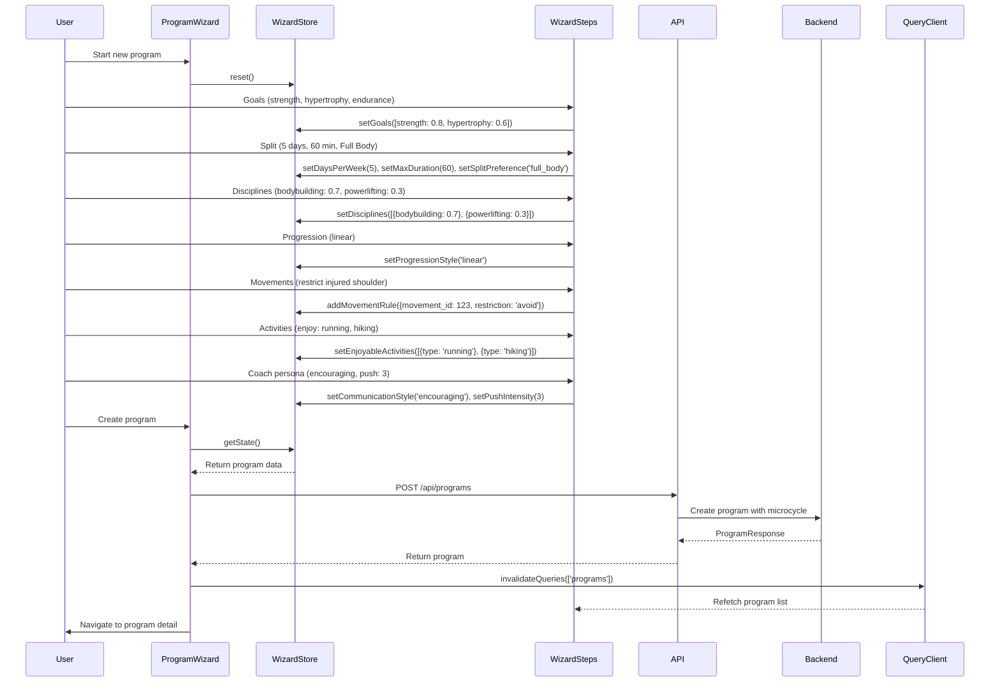
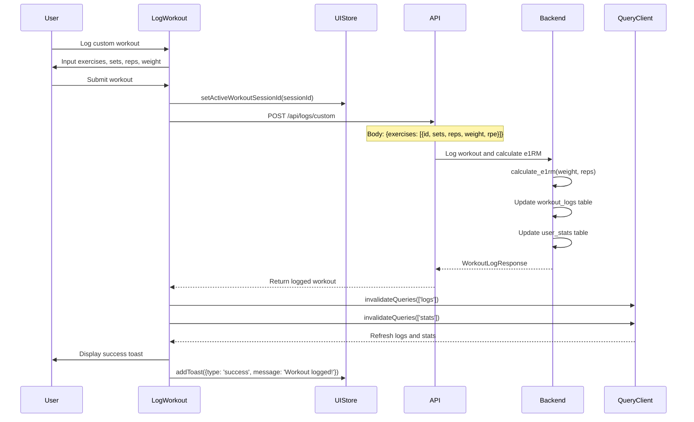
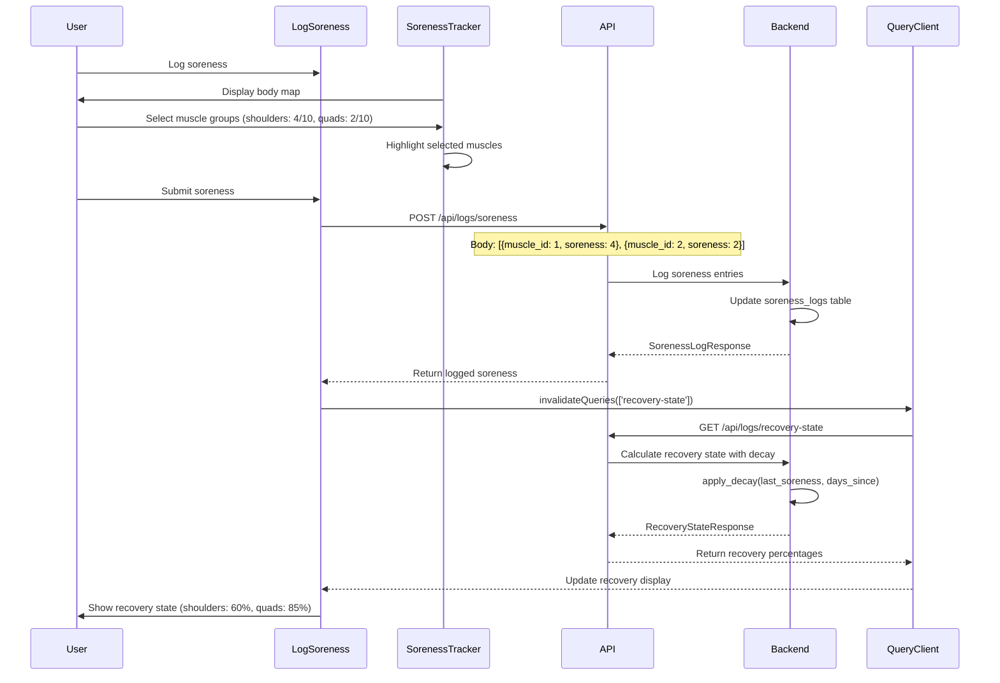
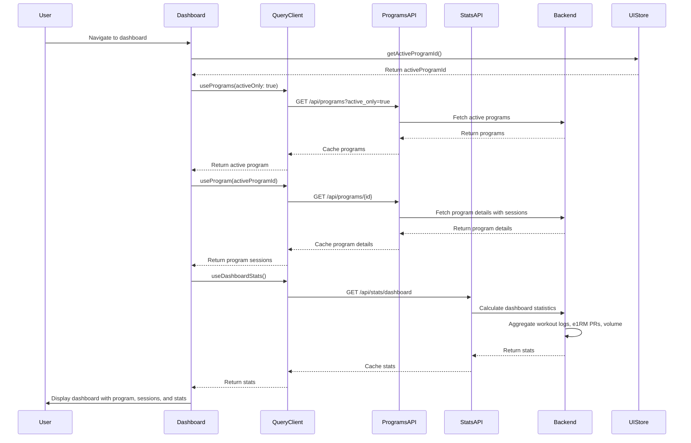
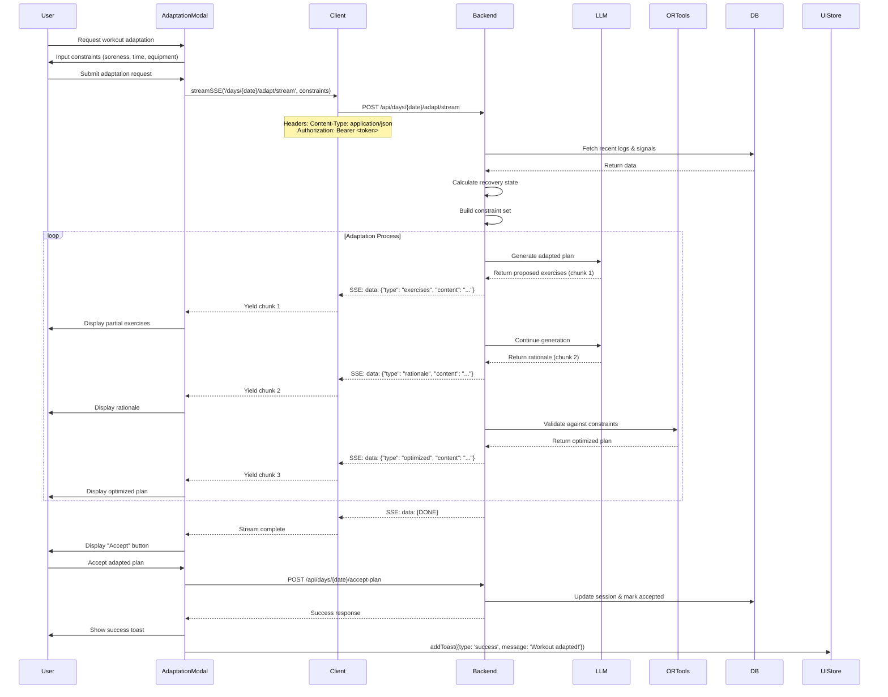
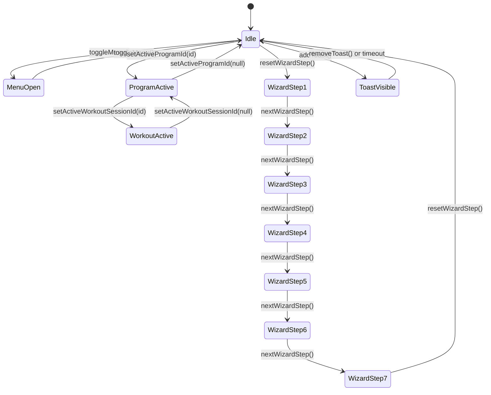
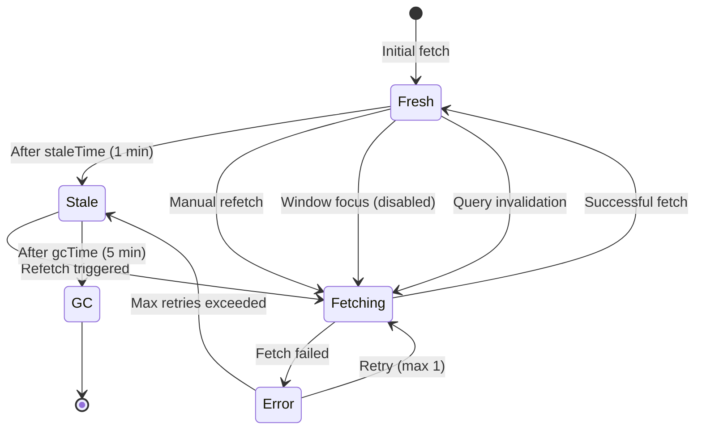
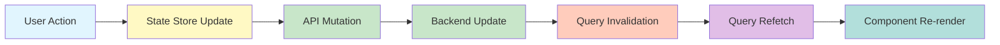

# Component Interaction Map

## Overview
This document maps the dependencies and event flows between frontend components, state stores, API services, and backend endpoints. It provides a comprehensive view of how data flows through the Gainsly application from user interactions to database persistence.

## Table of Contents
1. [Dependency Matrix](#dependency-matrix)
2. [Event Flows](#event-flows)
3. [SSE Streaming Flow](#sse-streaming-flow)
4. [State Synchronization](#state-synchronization)
5. [Cross-References](#cross-references)

---

## Dependency Matrix

### Frontend Component Dependencies

| Component | State Stores | API Hooks | UI Components | Backend Endpoints |
|-----------|--------------|-----------|---------------|-------------------|
| **Dashboard** | `useUIStore` (activeProgramId) | `usePrograms`, `useProgram`, `useDashboardStats` | `SessionCard`, `Button`, `Card` | GET /api/programs, GET /api/programs/{id}, GET /api/stats/dashboard |
| **ProgramWizard** | `useProgramWizardStore`, `useUIStore` (wizardStep) | `useCreateProgram` | All wizard step components, `WizardContainer` | POST /api/programs |
| **GoalsStep** | `useProgramWizardStore` (goals) | - | `Button`, `Card` | - |
| **SplitStep** | `useProgramWizardStore` (daysPerWeek, maxDuration, splitPreference) | - | `Button`, `Card` | - |
| **DisciplinesStep** | `useProgramWizardStore` (disciplines) | - | `Button`, `Card` | - |
| **ProgressionStep** | `useProgramWizardStore` (progressionStyle) | - | `Button`, `Card` | - |
| **MovementsStep** | `useProgramWizardStore` (movementRules) | - | `Button`, `Card` | - |
| **ActivitiesStep** | `useProgramWizardStore` (enjoyableActivities) | - | `Button`, `Card` | - |
| **CoachStep** | `useProgramWizardStore` (communicationStyle, pushIntensity) | - | `Button`, `Card` | - |
| **ProgramDetail** | `useUIStore` (activeProgramId) | `useProgram`, `useDeleteProgram` | `SessionCard`, `Button`, `Card` | GET /api/programs/{id}, DELETE /api/programs/{id} |
| **LogWorkout** | `useUIStore` (activeWorkoutSessionId) | `useLogWorkout`, `useLogTopSet` | `Button`, `Card`, `Spinner` | POST /api/logs/custom, POST /api/logs/top-set |
| **LogSoreness** | - | `useLogSoreness`, `useRecoveryState` | `SorenessTracker`, `HumanBodyMap`, `Button` | POST /api/logs/soreness, GET /api/logs/recovery-state |
| **Settings** | `useUIStore` (toasts) | `useUserProfile`, `useUpdateProfile` | `ProfileTab`, `ProgramsTab`, `FavoritesTab`, `Tabs` | GET /api/settings/profile, PUT /api/settings/profile |
| **ProfileTab** | - | `useUserProfile`, `useUpdateProfile`, `useMovementRules`, `useEnjoyableActivities` | `Button`, `Card` | GET/PUT /api/settings/profile, GET/POST/DELETE /api/settings/movement-rules, GET/POST /api/settings/enjoyable-activities |
| **BottomNav** | - | - | - | - |
| **AppShell** | `useUIStore` (isMenuOpen, theme) | - | `Header`, `BottomNav`, `BurgerMenu`, `ToastContainer` | - |

### State Store Dependencies

| State Store | Dependencies | Consumers |
|-------------|--------------|------------|
| **useUIStore** | Zustand, zustand/middleware (persist) | `AppShell`, `BottomNav`, `BurgerMenu`, `Dashboard`, `ProgramWizard`, `Settings` |
| **useProgramWizardStore** | Zustand, zustand/middleware (persist) | All wizard step components, `WizardContainer`, `program.wizard.tsx` |

### API Hook Dependencies

| API Hook | API Client | Backend Service | State Store Updates |
|----------|------------|-----------------|---------------------|
| **usePrograms** | `programsApi.list` | ProgramService | Query invalidation on mutations |
| **useProgram** | `programsApi.getById` | ProgramService | - |
| **useCreateProgram** | `programsApi.create` | ProgramService | Invalidates `['programs']` query |
| **useDeleteProgram** | `programsApi.delete` | ProgramService | Invalidates `['programs']` query |
| **useLogWorkout** | `logsApi.createCustom` | LogService | Invalidates `['logs']`, `['stats']` queries |
| **useLogTopSet** | `logsApi.logTopSet` | LogService | Invalidates `['logs']`, `['stats']` queries |
| **useLogSoreness** | `logsApi.logSoreness` | LogService | Invalidates `['recovery-state']` query |
| **useRecoveryState** | `logsApi.getRecoveryState` | LogService | - |
| **useUserProfile** | `settingsApi.getProfile` | SettingsService | - |
| **useUpdateProfile** | `settingsApi.updateProfile` | SettingsService | Invalidates `['profile']` query |
| **useDashboardStats** | `statsApi.getDashboard` | StatsService | - |

---

## Event Flows

### Program Creation Flow

**Key Events:**
- `setGoals()`: Updates wizard store state
- `setDaysPerWeek()`: Updates wizard store state
- `setSplitPreference()`: Updates wizard store state
- `addMovementRule()`: Adds movement restriction to wizard store
- `createProgram.mutateAsync()`: Triggers API call
- `queryClient.invalidateQueries(['programs'])`: Refreshes program list

---

### Workout Logging Flow

**Key Events:**
- `setActiveWorkoutSessionId()`: Sets active workout context
- `logWorkout.mutateAsync()`: Triggers API call
- `calculate_e1rm()`: Backend algorithm for estimated 1RM
- `invalidateQueries(['logs'])`: Refreshes workout history
- `invalidateQueries(['stats'])`: Refreshes dashboard statistics
- `addToast()`: Displays success notification

---

### Soreness Logging & Recovery State Flow

**Key Events:**
- `POST /api/logs/soreness`: Logs soreness entries
- `calculate_recovery_with_decay()`: Backend decay algorithm
- `invalidateQueries(['recovery-state'])`: Triggers recovery recalculation
- `GET /api/logs/recovery-state`: Fetches updated recovery state

---

### Dashboard Load Flow

**Key Events:**
- `usePrograms(activeOnly: true)`: Fetches active program
- `useProgram(activeProgramId)`: Fetches program details with sessions
- `useDashboardStats()`: Fetches dashboard statistics
- Query caching prevents redundant API calls
- Parallel fetching with TanStack Query

---

## SSE Streaming Flow

### Workout Adaptation Streaming

**SSE Event Types:**
- `exercises`: Proposed exercises from LLM
- `rationale`: Reasoning behind adaptations
- `optimized`: OR-Tools optimized plan
- `[DONE]`: Stream termination signal

**Key Events:**
- `streamSSE()`: Async generator yielding SSE chunks
- `POST /api/days/{date}/adapt/stream`: Backend SSE endpoint
- `LLM generation`: Chunked response streaming
- `OR-Tools validation`: Constraint optimization
- `accept-plan`: Commits adapted plan to database

---

## State Synchronization

### Client State (Zustand) Flow

### Server State (TanStack Query) Flow

### State Update Cascade

**Example Cascade:**
1. User creates program via wizard
2. `WizardStore` updated with program data
3. `createProgram.mutateAsync()` triggers API call
4. Backend creates program in database
5. `queryClient.invalidateQueries(['programs'])` triggered
6. TanStack Query refetches program list
7. Dashboard re-renders with new program

---

## Cross-References

### System Architecture
- See [01_System_Architecture.md](./01_System_Architecture.md) for system-level design
- See [02_Backend_API_and_Logic.md](./02_Backend_API_and_Logic.md) for API endpoints
- See [03_Frontend_Architecture.md](./03_Frontend_Architecture.md) for component details

### Database Schema
- See [DATABASE_OVERVIEW.md](../DATABASE_OVERVIEW.md) for data models
- State stores mirror database models for consistency

### Implementation Plans
- See `docs/plans/adaptive-workout-loop.md` for adaptation flow details
- See `docs/plans/llm-integration.md` for LLM streaming implementation
- See `docs/plans/optimization-engine.md` for OR-Tools integration

---

## Glossary

- **Dependency Matrix**: Table showing component dependencies and data flow
- **Event Flow**: Sequence of events triggered by user actions
- **SSE**: Server-Sent Events for real-time streaming
- **Query Invalidation**: TanStack Query mechanism to refresh stale data
- **State Cascade**: Chain reaction of state updates across the app
- **Wizard Store**: Zustand store for multi-step program creation
- **UI Store**: Zustand store for global UI state
- **Mutation**: TanStack Query operation that modifies server state

---

## Tags

#component-interaction #dependency-matrix #event-flows #sse #state-synchronization #frontend #backend #zustand #tanstack-query #api-integration #data-flow #architecture
